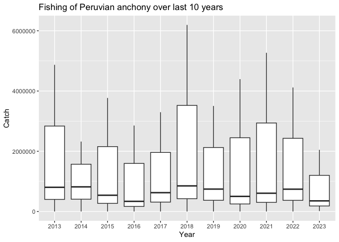
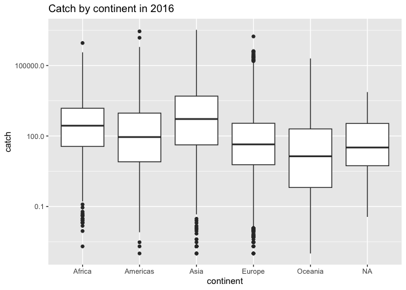

## Instructions
Answer the following questions and/or complete the exercises in RMarkdown. Please embed all of your code and push the final work to your repository. Your report should be organized, clean, and run free from errors. Remember, you must remove the `#` for any included code chunks to run.  

## Load the libraries

``` r
library("tidyverse")
library("janitor")
library("naniar")
options(scipen = 999)
```

## About the Data
For this assignment we are going to work with a data set from the [United Nations Food and Agriculture Organization](https://www.fao.org/fishery/en/collection/capture) on world fisheries. These data were downloaded and cleaned using the `fisheries_clean.Rmd` script.  

Load the data `fisheries_clean.csv` as a new object titled `fisheries_clean`.

``` r
fisheries_clean <- read_csv("data/fisheries_clean.csv")
```

1. Explore the data. What are the names of the variables, what are the dimensions, are there any NA's, what are the classes of the variables, etc.? You may use the functions that you prefer.

``` r
glimpse(fisheries_clean)
```

```
## Rows: 1,055,015
## Columns: 9
## $ period          <dbl> 1950, 1951, 1952, 1953, 1954, 1955, 1956, 1957, 1958, …
## $ continent       <chr> "Asia", "Asia", "Asia", "Asia", "Asia", "Asia", "Asia"…
## $ geo_region      <chr> "Southern Asia", "Southern Asia", "Southern Asia", "So…
## $ country         <chr> "Afghanistan", "Afghanistan", "Afghanistan", "Afghanis…
## $ scientific_name <chr> "Osteichthyes", "Osteichthyes", "Osteichthyes", "Ostei…
## $ common_name     <chr> "Freshwater fishes NEI", "Freshwater fishes NEI", "Fre…
## $ taxonomic_code  <chr> "1990XXXXXXXX106", "1990XXXXXXXX106", "1990XXXXXXXX106…
## $ catch           <dbl> 100, 100, 100, 100, 100, 200, 200, 200, 200, 200, 200,…
## $ status          <chr> "A", "A", "A", "A", "A", "A", "A", "A", "A", "A", "A",…
```

``` r
summary(fisheries_clean)
```

```
##      period      continent          geo_region          country         
##  Min.   :1950   Length:1055015     Length:1055015     Length:1055015    
##  1st Qu.:1980   Class :character   Class :character   Class :character  
##  Median :1996   Mode  :character   Mode  :character   Mode  :character  
##  Mean   :1994                                                           
##  3rd Qu.:2010                                                           
##  Max.   :2023                                                           
##  scientific_name    common_name        taxonomic_code         catch           
##  Length:1055015     Length:1055015     Length:1055015     Min.   :       0.0  
##  Class :character   Class :character   Class :character   1st Qu.:       0.0  
##  Mode  :character   Mode  :character   Mode  :character   Median :       2.9  
##                                                           Mean   :    5089.9  
##                                                           3rd Qu.:     400.0  
##                                                           Max.   :12277000.0  
##     status         
##  Length:1055015    
##  Class :character  
##  Mode  :character  
##                    
##                    
## 
```

Variables: period, continent, geo_region, country, scientific_name, common_name, taxonomic_code, catch, status. 
1055015 rows 9 columns. 
Yes NA, although summary functions don't show it. 
Character and double-precision floating point variables. 

2. Convert the following variables to factors: `period`, `continent`, `geo_region`, `country`, `scientific_name`, `common_name`, `taxonomic_code`, and `status`.

``` r
fisheries_clean <- fisheries_clean %>% 
  mutate(period=as.factor(period),
         continent=as.factor(continent),
         geo_region=as.factor(geo_region),
         country=as.factor(country), 
         scientific_name=as.factor(scientific_name),
         common_name=as.factor(common_name),
         taxonomic_code=as.factor(taxonomic_code),
         status=as.factor(status))
```

3. Are there any missing values in the data? If so, which variables contain missing values and how many are missing for each variable?


``` r
colSums(is.na(fisheries_clean))
```

```
##          period       continent      geo_region         country scientific_name 
##               0           23811           23811               0               0 
##     common_name  taxonomic_code           catch          status 
##            2846               0               0               0
```


``` r
fisheries_clean %>% 
  summarise(across(everything(), ~ sum(is.na(.))))
```

```
## # A tibble: 1 × 9
##   period continent geo_region country scientific_name common_name taxonomic_code
##    <int>     <int>      <int>   <int>           <int>       <int>          <int>
## 1      0     23811      23811       0               0        2846              0
## # ℹ 2 more variables: catch <int>, status <int>
```

There are 23811 missing for continent and geo_region, 2846 missing for common_name. No other NAs. 

4. How many countries are represented in the data?

``` r
fisheries_clean %>% 
  summarize(count = n_distinct(country))
```

```
## # A tibble: 1 × 1
##   count
##   <int>
## 1   249
```

249 (including other)

5. The variables `common_name` and `taxonomic_code` both refer to species. How many unique species are represented in the data based on each of these variables? Are the numbers the same or different?

``` r
fisheries_clean %>% 
  summarize(count_name = n_distinct(common_name), count_code = n_distinct(taxonomic_code))
```

```
## # A tibble: 1 × 2
##   count_name count_code
##        <int>      <int>
## 1       3390       3722
```

Taxonomic code: 3722 levels. Common name: 3390 levels. Different, since common name includes NAs.

6. In 2023, what were the top five countries that had the highest overall catch?

``` r
fisheries_clean %>% 
  select(country, catch) %>% 
  arrange(desc(catch)) %>% 
  distinct(country) %>% 
  head(5)
```

```
## # A tibble: 5 × 1
##   country                                     
##   <fct>                                       
## 1 Peru                                        
## 2 Japan                                       
## 3 Chile                                       
## 4 China                                       
## 5 Union of Soviet Socialist Republics [former]
```

Peru, Japan, Chile, China, Union of Soviet Socialist Republics

7. In 2023, what were the top 10 most caught species? To keep things simple, assume `common_name` is sufficient to identify species. What does `NEI` stand for in some of the common names? How might this be concerning from a fisheries management perspective?

``` r
fisheries_clean %>% 
  filter(period=="2023") %>% 
  select(common_name, catch) %>% 
  arrange(desc(catch)) %>% 
  distinct(common_name) %>% 
  head(10)
```

```
## # A tibble: 10 × 1
##    common_name                   
##    <fct>                         
##  1 Marine fishes NEI             
##  2 Anchoveta(=Peruvian anchovy)  
##  3 Alaska pollock(=Walleye poll.)
##  4 Freshwater fishes NEI         
##  5 Largehead hairtail            
##  6 Chilean jack mackerel         
##  7 Cyprinids NEI                 
##  8 European pilchard(=Sardine)   
##  9 Pacific sardine               
## 10 Japanese anchovy
```

Top ten caught fish: Marine fishes NEI, Anchoveta(=Peruvian anchovy), Alaska pollock(=Walleye poll.), Freshwater fishes NEI, Largehead hairtail, Chilean jack mackerel, Cyprinids NEI, European pilchard(=Sardine), Pacific sardine, Japanese anchovy.
NEI I think is not elsewhere included, which basically could be anything, including endangered species. 

8. For the species that was caught the most above (not NEI), which country had the highest catch in 2023?

``` r
fisheries_clean %>% 
  filter(common_name=="Anchoveta(=Peruvian anchovy)" & period=="2023") %>% 
  select(country, catch) %>% 
  arrange(desc(catch)) %>% 
  head(5)
```

```
## # A tibble: 3 × 2
##   country    catch
##   <fct>      <dbl>
## 1 Peru    2047732.
## 2 Chile    353267 
## 3 Ecuador   14710.
```

Peru

9. How has fishing of this species changed over the last decade (2013-2023)? Create a  plot showing total catch by year for this species.

``` r
fisheries_clean %>% 
  filter(common_name=="Anchoveta(=Peruvian anchovy)",
         period %in% c("2013","2014","2015","2016","2017","2018","2019","2020","2021","2022","2023")) %>% 
  ggplot(mapping=aes(x=period,y=catch))+
  geom_boxplot()+
  labs(title="Fishing of Peruvian anchony over last 10 years", x="Year",y="Catch")
```

<!-- -->

Fishing of the peruvian anchovy has stayed relatively constant, with decreases in 2016, 2020, and 2023. It was highest in 2018.

10. Perform one exploratory analysis of your choice. Make sure to clearly state the question you are asking before writing any code.

In 2016, which each continent had the highest catch rate? 


``` r
fisheries_clean %>% 
  filter(period=="2016") %>% 
  ggplot(mapping=aes(x=continent,y=catch))+
  geom_boxplot()+
  scale_y_log10()+
  labs(title="Catch by continent in 2016")
```

```
## Warning in scale_y_log10(): log-10 transformation introduced infinite values.
```

```
## Warning: Removed 7616 rows containing non-finite outside the scale range
## (`stat_boxplot()`).
```

<!-- -->
Asia, followed by Africa. They are all pretty similar in number. 

## Knit and Upload
Please knit your work as an .html file and upload to Canvas. Homework is due before the start of the next lab. No late work is accepted. Make sure to use the formatting conventions of RMarkdown to make your report neat and clean!  
